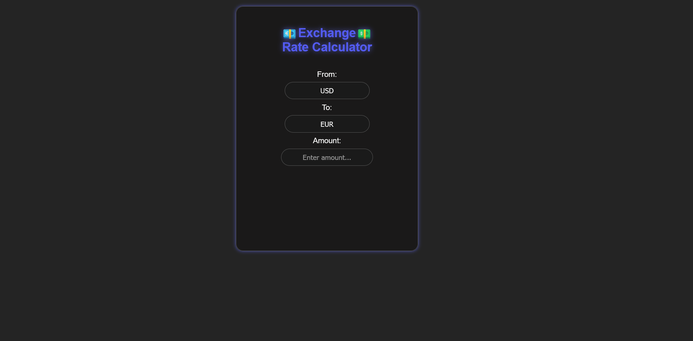
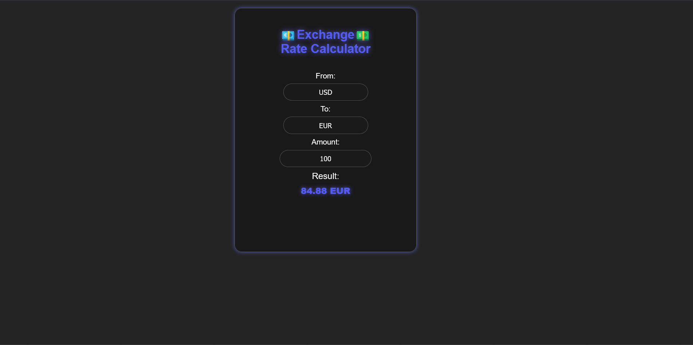
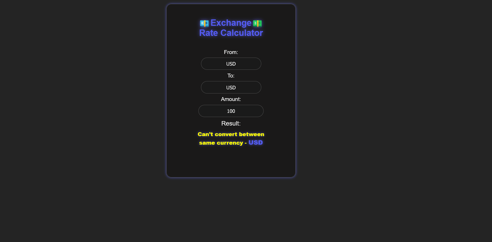

# Exchange Rate Calculator

A simple and intuitive currency converter built with React. It lets users enter an amount, select currencies, and instantly see converted values using a reliable currency exchange API.

> [!WARNING]
> This project was developed personally as a learning exercise and an experiment with React and API integration. It is not intended for everyday use and is not deployed or hosted publicly.

## Features

- 💵 Enter amount to convert between currencies.
- 🌍 Select from a wide range of currencies.
- 🔄 Instant conversion with up-to-date exchange rates.
- ♻️ Swap currencies easily.
- 🧠 Intuitive UX with responsive design.
- ⚠️ Error handling for invalid input or API failures.

## Tech Stack

- React 
- Frankfurter api 
- Vite 

- HTML5 
- CSS 

## Screenshots

### Main Converter



### Converted Results




## How to run

```bash
git clone https://github.com/KucielKrzysztof/currency-converter.git
cd currency-converter
npm i
npm run dev
```
